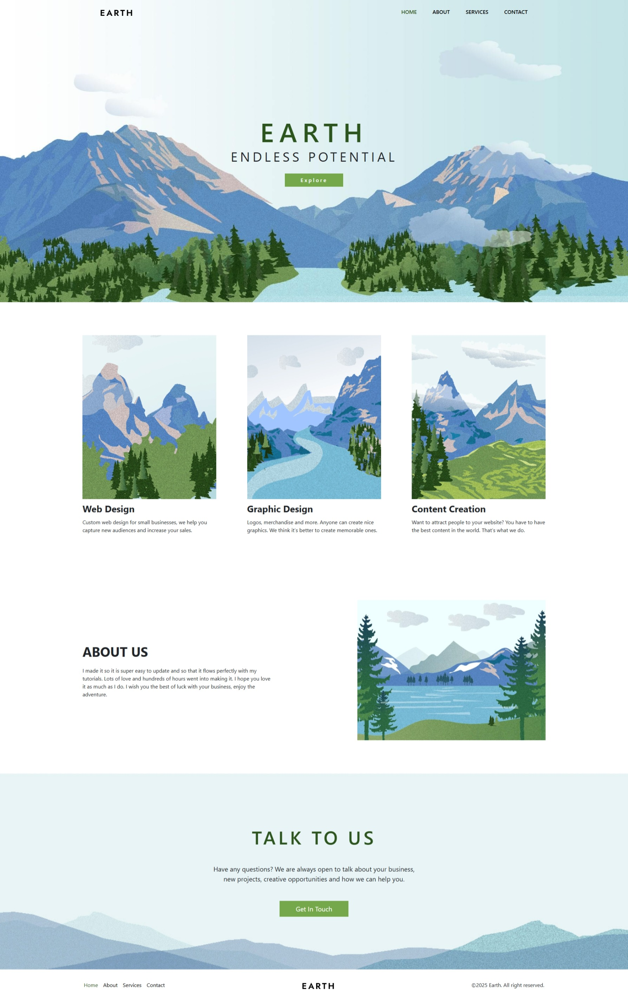
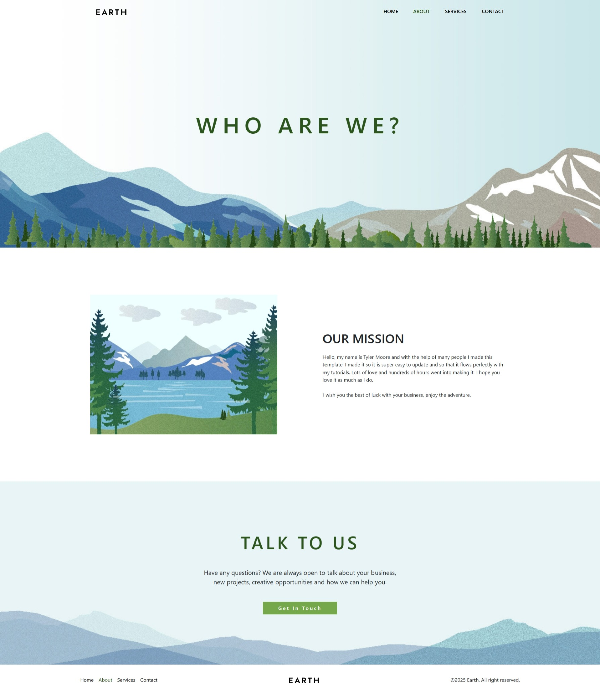
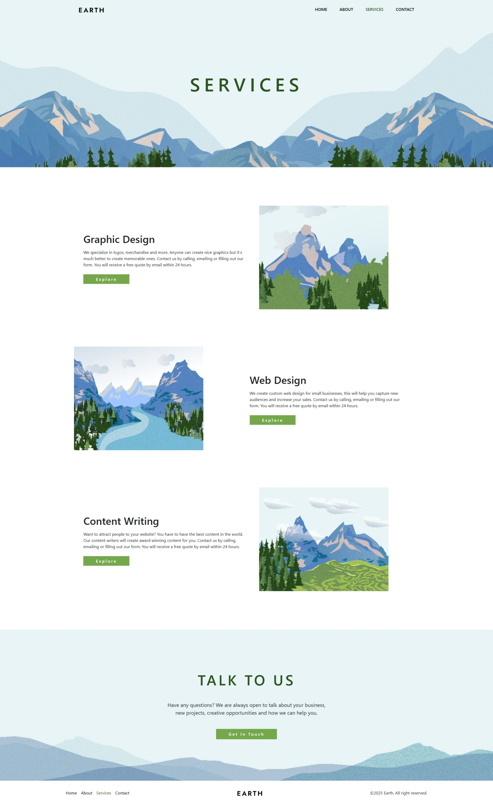
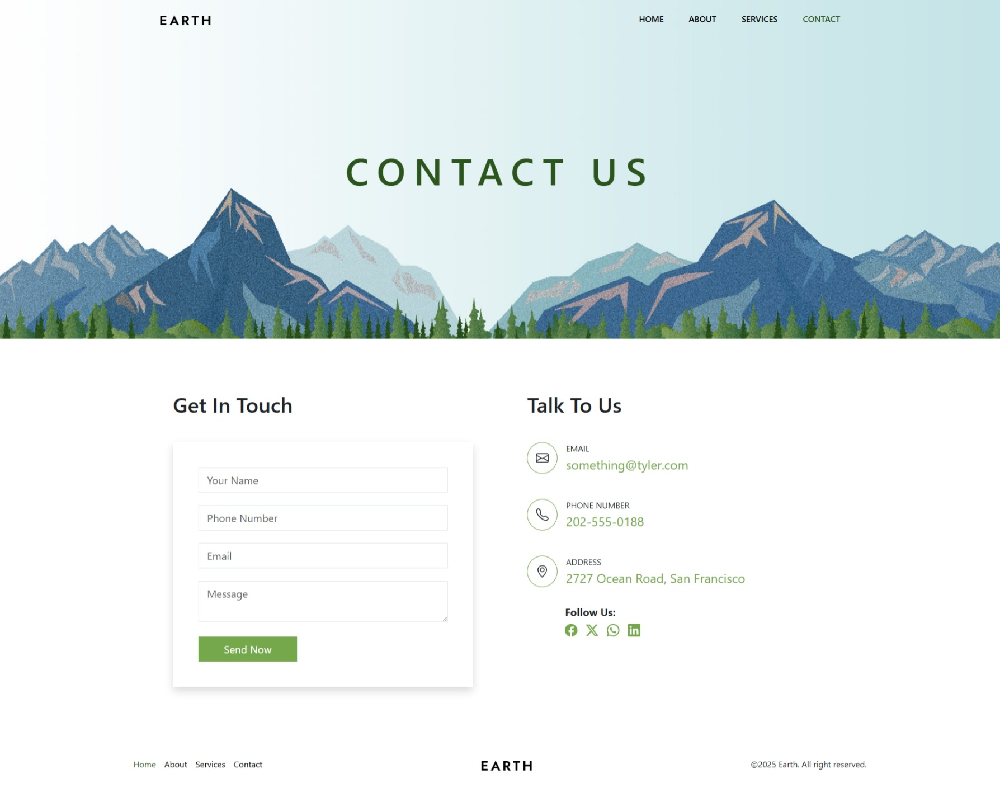

# Earth [Project 1 (FSWD Foundation)]

A modern, responsive web design agency website built with Bootstrap 5, showcasing professional web design, graphic design, and content creation services with smooth animations and a clean, professional design.

## ✨ Features

### Core Agency Features

- **Responsive Design**: Fully responsive layout that works seamlessly across all devices
- **Modern UI**: Clean and professional design using Bootstrap 5 framework
- **Navigation**: Intuitive navigation with smooth transitions between pages
- **Service Showcase**: Dedicated sections for web design, graphic design, and content creation services
- **Contact Integration**: Contact page for client inquiries and business opportunities
- **Optimized Performance**: Lightweight and fast-loading pages
- **Animated Elements**: Smooth animations and transitions

### Interactive Elements

- **Hero Section**: Eye-catching hero area with call-to-action
- **About Section**: Company information and team presentation
- **Services Gallery**: Showcase of web design, graphic design, and content creation services
- **Contact Form**: Functional contact section for client inquiries

## 🛠️ Tech Stack

- **Framework**: Bootstrap 5.3.2
- **Language**: HTML5 & CSS3
- **JavaScript**: Vanilla JavaScript with Bootstrap components
- **Icons**: Bootstrap Icons
- **Styling**: Custom CSS with Bootstrap utilities
- **Images**: Optimized responsive images

## 📁 Project Structure

```
bs5-project-earth/
├── assets/                 # Static assets (images, logos)
│   ├── preview/           # Page preview screenshots
│   │   ├── home.jpeg       # Home page preview
│   │   ├── about.jpeg      # About page preview
│   │   ├── services.jpeg   # Services page preview
│   │   └── contact.jpeg    # Contact page preview
│   ├── banner.jpg          # Hero section background
│   ├── about-banner.jpg    # About page banner
│   ├── call-to-action.jpg  # Call-to-action background
│   └── contact-banner.jpg  # Contact page banner
├── css/                   # Stylesheets
│   ├── bootstrap.min.css  # Bootstrap framework
│   └── style.css          # Custom styles
├── js/                    # JavaScript files
│   ├── bootstrap.bundle.min.js  # Bootstrap JS
│   └── script.js         # Custom scripts
├── index.html             # Home page
├── about.html             # About page
├── services.html          # Services page
├── contact.html           # Contact page
├── LICENSE                # MIT License file
└── README.md              # Project documentation
```

## 🚀 Getting Started

### Prerequisites

- Modern web browser (Chrome, Firefox, Safari, Edge)
- Local web server (optional, for development)

### Installation

1. Clone the repository:

```bash
git clone https://github.com/citindia/bs5-project-earth.git
cd bs5-project-earth
```

2. Open `index.html` in your web browser to view the website

## 🎯 Usage

### Navigation

- Use the navigation menu to jump between different pages
- Smooth transitions between pages
- Responsive hamburger menu on mobile devices

### Pages

- **Home**: Hero section with call-to-action and service overview
- **About**: Company information and team details
- **Services**: Detailed showcase of web design, graphic design, and content creation services
- **Contact**: Contact form and business inquiry information

### Theme Features

- Responsive design adapts to all screen sizes
- Smooth animations and transitions
- Professional color scheme and typography
- Interactive hover states and micro-interactions

## � Preview

### Home Page



### About Page



### Services Page



### Contact Page



## � Development

### Code Style

- Semantic HTML5 markup for accessibility
- Bootstrap 5 best practices
- Responsive-first design approach
- Clean, maintainable CSS architecture
- Optimized image assets

### Component Architecture

- Bootstrap 5 component-based structure
- Modular CSS organization
- JavaScript for interactive elements
- Responsive grid system implementation

### UI Framework

- Bootstrap 5 framework for consistent design
- Custom CSS for unique styling
- Responsive design patterns
- Cross-browser compatibility

## 📄 License

This project is licensed under the MIT License - see the [LICENSE](LICENSE) file for details.

## 👤 Author

**Saikat Sardar**

- GitHub: [@citindia](https://github.com/citindia)
- Project Homepage: [https://github.com/citindia/bs5-project-earth](https://github.com/citindia/bs5-project-earth)
